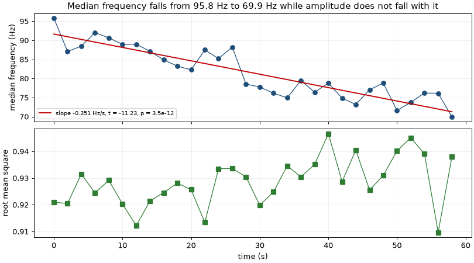
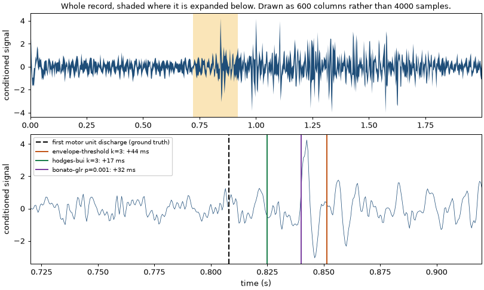
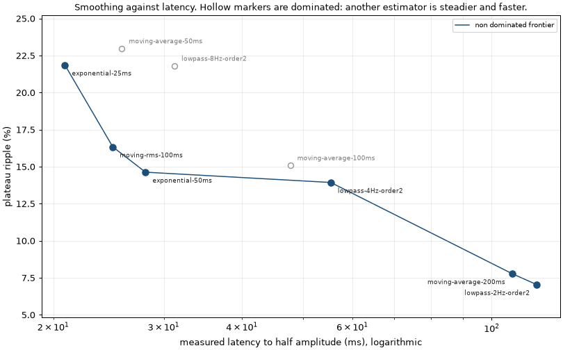

# Myoelectric Signal Processing

Filtering, onset detection, and a time and frequency domain feature library for myoelectric signals.

[](https://github.com/Eelis03/myoelectric-signal-processing/actions/workflows/ci.yml)
[](https://www.python.org/downloads/)
[](LICENSE)



That is the spectral compression of muscle fatigue, recovered from a synthetic contraction by
the median frequency implementation in this library. It is the most reliably reproduced effect
in surface electromyography, which is why it is used here as a test of the implementation
rather than presented as a finding: a median frequency that fails to fall is wrong.

This is a library of building blocks for the stage between a surface electromyography amplifier
and a prosthesis controller. Everything below is a recipe you can lift, and every recipe states
what it costs in delay, because delay is the currency of this problem. Farrell and Weir (2007)
measured the delay a myoelectric prosthesis user tolerates and reported an upper bound near
100 ms to 125 ms covering everything from the muscle contracting to the device moving. A stage
that cannot say what it spends of that cannot be assembled into a chain.

## Installation

Requires Python 3.12 or later. Continuous integration runs the whole suite on 3.12 and 3.13, on
Linux and on Windows, so the version floor in `pyproject.toml` is a tested claim rather than a
declared one.

```bash
git clone https://github.com/Eelis03/myoelectric-signal-processing.git
cd myoelectric-signal-processing
uv sync
```

Using pip instead of uv:

```bash
python -m venv .venv
.venv/bin/activate      # Windows: .venv\Scripts\activate
pip install -e ".[dev]"
```

The package ships a `py.typed` marker, so its annotations are visible to anything that
installs it rather than stopping at this repository's own type check.

## Recipes

Each of these runs as written. `raw` is a one dimensional array of samples and
`sample_rate_hz` is its sample rate; `src/myoelectric/pipeline/loaders.py` produces both from
a `.npz` or `.csv` export, and `src/myoelectric/pipeline/generation.py` produces them from the
documented synthetic generator that every number on this page comes from.

### Condition a raw channel

Movement artefact sits below the signal band, mains interference sits inside it as narrow
lines, and instrumentation noise covers all of it. One band pass and one notch cascade deal
with all three, and the cascade is applied causally because a controller has no future samples.

```python
import numpy as np
from myoelectric.algorithm.filters import (
    apply_causal,
    cascade,
    design_bandpass,
    design_powerline_notch,
)

chain = cascade(
    (design_bandpass(sample_rate_hz), design_powerline_notch(sample_rate_hz)),
    name="bandpass then notch",
    rationale="Movement artefact below the band, mains lines inside it, noise above it.",
)
conditioned = apply_causal(chain, raw)
print(chain.group_delay_ms(np.array([20.0, 120.0, 250.0])))
```

Cost, at 2000 Hz: **31.95 ms at 20 Hz, 2.57 ms at 120 Hz, 1.24 ms at 250 Hz.** A filter does
not have one delay. The band pass alone runs from 1.18 ms at 250 Hz to 31.68 ms at its 20 Hz
corner, a factor of 27, and the corner is exactly where the envelope of a rising contraction
carries much of its energy. Weighted across the band by the power that survives the chain, the
whole cascade costs 4.16 ms. Quoting either number without saying which it is means nothing.

### Detect an onset causally

Three detectors implement one protocol, so swapping between them changes nothing else.

```python
from myoelectric.algorithm.onset import BonatoDetector, EnvelopeThresholdDetector, HodgesBuiDetector

detector = HodgesBuiDetector()  # or EnvelopeThresholdDetector(), BonatoDetector()
result = detector.detect(conditioned, sample_rate_hz)
print(result.first_onset_index, result.onset_indices, result.threshold)
print(detector.decision_delay_s(sample_rate_hz))
```

Cost: **25.0 ms of decision delay** for Hodges and Bui, 50.0 ms for the envelope threshold,
5.0 ms for the Bonato style detector, at 2000 Hz. That is separate from the timing bias, which
is 6.7 ms to 12.9 ms for Hodges and Bui above 10 dB. Bias says where the detector places the
onset and can be corrected for afterwards; decision delay is how long the controller waits
before it is told anything, and nothing recovers it. A controller pays both.

Threshold is not the only knob that matters. Every one of these detectors reaches a detection
rate of one at some setting, and the setting that does it may also fire constantly on a resting
record. The two rates are only meaningful read together, which is what the Results section does.



The lower panel is the argument for measuring rather than annotating. The ground truth is the
sample at which the first motor unit discharged, and one discharge does not lift the trace out
of the noise, so the instant is invisible. Every detector is necessarily late, and the 27 ms
that separates the best from the worst is smaller than the region in which a human would place
the onset by eye.

### Extract the Hudgins feature set

Two thresholds, in two different units, which is the mistake this signature exists to prevent.
Zero crossings and Willison amplitude compare an amplitude, so their threshold has the units of
the signal. Slope sign changes compare a product of two first differences, so its threshold has
the units of the signal squared. Setting both to the same number is a units error that silently
returns zero on an oversampled record.

```python
import numpy as np
from myoelectric.algorithm.features_freq import frequency_domain_features, welch_spectrum
from myoelectric.algorithm.features_time import time_domain_features

rest = conditioned[:700]  # a leading resting segment
window = conditioned[2000:2500]  # 0.25 s of contraction

time_domain = time_domain_features(
    window,
    amplitude_threshold=3.0 * float(np.std(rest)),
    slope_threshold=float(np.var(np.diff(rest))),
)
frequency_domain = frequency_domain_features(welch_spectrum(window, sample_rate_hz))
```

Cost: **the window length, 500 samples at 2000 Hz, which is 250 ms.** A trailing feature window
has to be complete before the features exist, so the window is the delay, and this one is twice
the whole controller budget on its own. That is a choice the caller makes, and it is the reason
the delay budget in the last recipe takes explicit stages rather than guessing.

Every feature scales as its definition says it should. Under a gain of two, mean absolute value,
root mean square, waveform length and integrated electromyogram scale by exactly 2.0000,
variance by exactly 4.0000, and the counting and spectral features do not move at all, provided
each threshold is scaled by the factor its own units require.

### Estimate an envelope for proportional control

```python
from myoelectric.algorithm.envelope import (
    ExponentialEnvelope,
    LowPassEnvelope,
    MovingAverageEnvelope,
    MovingRmsEnvelope,
)

estimator = ExponentialEnvelope(0.050)  # cheapest to run on an embedded controller
amplitude = estimator.estimate(conditioned, sample_rate_hz)
print(estimator.nominal_delay_samples(sample_rate_hz))
```

Cost: **28.1 ms of measured latency for 14.6 per cent plateau ripple.** Across the nine
estimators the trade runs from 20.9 ms at 21.9 per cent ripple to 118.1 ms at 7.0 per cent.
Every point of steadiness is paid for in delay, and three of the nine are dominated: something
else in the same table is both steadier and faster.

### Check the whole chain against a delay budget

Each stage above reports what it spends. This adds them up and refuses a chain that does not fit.

```python
from myoelectric.analysis.delay_budget import (
    assemble_budget,
    detector_stage,
    enforce,
    envelope_stage,
    filter_stage,
)

budget = enforce(
    assemble_budget(
        (
            filter_stage(chain, (20.0, 450.0)),  # raises on a zero phase design
            detector_stage(detector, sample_rate_hz),
            envelope_stage(estimator, sample_rate_hz),
        )
    )
)
print(budget.total_ms, budget.headroom_ms, budget.dominant_stage.name)
```

Cost: **78.91 ms of the 125 ms bound, 46.09 ms of headroom** for the classifier and the
actuator, which this library does not implement and which therefore have to be entered by the
caller. Swapping the amplitude estimator for the steadiest one in the table, on the grounds
that 7.0 per cent ripple beats 14.6 per cent, puts the chain 16.70 ms over and `enforce` raises.
A zero phase design cannot be entered at all: its group delay is zero only because its reverse
pass reads samples that have not been acquired.

## Causal against zero phase

This distinction runs through everything above and it is not stylistic.

`apply_zero_phase` runs the filter forwards and then backwards. The two passes have equal and
opposite phase responses, so the combined phase is exactly zero, the attenuation is doubled in
decibels, and no feature is displaced in time. It is the right choice for offline analysis, and
the fatigue analysis at the top of this page uses it.

It is unusable on a prosthesis. Producing the output at one sample requires samples that have
not been acquired. Three specific consequences follow, and all three are visible in this
repository rather than asserted:

- `group_delay_samples` returns exactly zero for `zero_phase` and the frequency dependent
  design value for `causal`. A burst at 100 Hz is displaced by 3.38 samples under causal
  filtering, against a design group delay of 3.37 samples, and by -0.00 samples under zero
  phase filtering.
- A detector evaluated after a zero phase filter reports less bias than the same detector
  would have in a controller, because the filter has smeared the onset backwards in time. The
  detector sweep below therefore uses causal filtering throughout.
- `filter_stage` refuses a `zero_phase` design outright rather than charging the budget zero.

The test suite demonstrates the distinction rather than describing it: one sample of the input
is perturbed and the outputs that move are checked, which under causal filtering are only the
samples after it.

## Results

Every number here is printed by the command named above it, at a 2000 Hz sample rate, on
synthetic signals, with the generator seeded at 20260731.

### Filter responses

`uv run python examples/filter_design.py`. Band pass, 20 Hz to 450 Hz, fourth order
Butterworth. Group delay is computed from the design by summing the group delays of its second
order sections, which is exact because delays add in cascade.

| Frequency (Hz) | Causal gain (dB) | Causal group delay (ms) | Zero phase gain (dB) | Zero phase group delay (ms) |
| ---: | ---: | ---: | ---: | ---: |
| 5 | -49.40 | 20.68 | -98.80 | 0.00 |
| 10 | -25.09 | 23.28 | -50.17 | 0.00 |
| 20 | -3.01 | 31.68 | -6.02 | 0.00 |
| 50 | -0.00 | 4.46 | -0.00 | 0.00 |
| 100 | -0.00 | 1.69 | -0.00 | 0.00 |
| 250 | -0.00 | 1.18 | -0.01 | 0.00 |
| 450 | -3.01 | 2.01 | -6.02 | 0.00 |
| 600 | -17.46 | 1.06 | -34.93 | 0.00 |
| 800 | -45.74 | 0.62 | -91.48 | 0.00 |

Power line notch, 50 Hz with two harmonics, quality factor 30, so each section is 1.67 Hz wide
at the fundamental.

| Frequency (Hz) | Gain (dB) | Group delay (ms) |
| ---: | ---: | ---: |
| 45 | -0.11 | 5.34 |
| 48 | -0.67 | 28.59 |
| 50 | -250.97 | nan |
| 52 | -0.72 | 28.28 |
| 55 | -0.13 | 5.36 |
| 100 | -274.04 | nan |
| 150 | -276.07 | nan |

The gain at a notch centre is a transmission zero, so the printed figure is limited only by
floating point, and the group delay there is undefined rather than large, which is why those
entries read `nan`. Note what the delay column does either side of it: a component 5 Hz from
the mains passes almost untouched and is delayed 5.3 ms, while one 2 Hz away is delayed 28.6 ms.
A narrow notch is cheap in amplitude and expensive in time, and that is where the difference
between the two delay budget rules below comes from.

Measured against injected contamination on a generated record, over the settled part after the
first 0.5 s, the band pass and notch chain gives:

| Component | Root mean square before | After | Change (dB) |
| --- | ---: | ---: | ---: |
| Power line | 0.2430 | 0.0040 | -35.7 |
| Movement artefact | 0.2492 | 0.0027 | -39.4 |
| Wideband noise | 0.1795 | 0.1160 | -3.8 |
| Clean signal | 0.9873 | 0.9433 | -0.4 |

### Onset detection against signal to noise ratio

`uv run python examples/onset_benchmark.py`. Sixty active trials and sixty resting trials at
each ratio, 2 s each, causal band pass before detection, match tolerance 150 ms. Bias is
positive when the detection is late. Detector settings are the ones each source recommends.

| Detector | SNR (dB) | Detection rate | False positive rate | FP per s | Bias mean (ms) | Bias SD (ms) | Bias p25 (ms) | Bias median (ms) | Bias p75 (ms) |
| --- | ---: | ---: | ---: | ---: | ---: | ---: | ---: | ---: | ---: |
| envelope-threshold k=3 | -5 | 0.000 +/- 0.000 | 0.000 +/- 0.000 | 0.000 | nan | nan | nan | nan | nan |
| envelope-threshold k=3 | 0 | 0.600 +/- 0.063 | 0.000 +/- 0.000 | 0.000 | 100.9 | 28.3 | 83.0 | 102.8 | 125.2 |
| envelope-threshold k=3 | 5 | 1.000 +/- 0.000 | 0.000 +/- 0.000 | 0.000 | 64.7 | 23.7 | 47.2 | 61.8 | 77.6 |
| envelope-threshold k=3 | 10 | 1.000 +/- 0.000 | 0.000 +/- 0.000 | 0.000 | 47.8 | 18.2 | 32.9 | 47.5 | 58.2 |
| envelope-threshold k=3 | 15 | 1.000 +/- 0.000 | 0.000 +/- 0.000 | 0.000 | 41.8 | 19.9 | 29.3 | 36.5 | 44.9 |
| envelope-threshold k=3 | 20 | 1.000 +/- 0.000 | 0.000 +/- 0.000 | 0.000 | 39.3 | 12.7 | 31.0 | 37.2 | 44.2 |
| hodges-bui k=3 | -5 | 0.333 +/- 0.061 | 0.000 +/- 0.000 | 0.000 | 81.4 | 46.4 | 37.4 | 98.8 | 118.6 |
| hodges-bui k=3 | 0 | 1.000 +/- 0.000 | 0.000 +/- 0.000 | 0.000 | 52.4 | 30.5 | 32.2 | 53.8 | 70.2 |
| hodges-bui k=3 | 5 | 1.000 +/- 0.000 | 0.000 +/- 0.000 | 0.000 | 21.4 | 18.5 | 8.5 | 14.0 | 34.6 |
| hodges-bui k=3 | 10 | 1.000 +/- 0.000 | 0.000 +/- 0.000 | 0.000 | 12.9 | 15.4 | 1.0 | 9.8 | 24.1 |
| hodges-bui k=3 | 15 | 1.000 +/- 0.000 | 0.000 +/- 0.000 | 0.000 | 6.7 | 14.1 | -2.6 | 3.2 | 11.5 |
| hodges-bui k=3 | 20 | 1.000 +/- 0.000 | 0.000 +/- 0.000 | 0.000 | 8.4 | 10.8 | 0.5 | 6.5 | 16.0 |
| bonato-glr p=0.001 | -5 | 0.000 +/- 0.000 | 0.000 +/- 0.000 | 0.000 | nan | nan | nan | nan | nan |
| bonato-glr p=0.001 | 0 | 0.233 +/- 0.055 | 0.000 +/- 0.000 | 0.000 | 86.9 | 40.5 | 59.2 | 80.2 | 122.4 |
| bonato-glr p=0.001 | 5 | 0.717 +/- 0.058 | 0.000 +/- 0.000 | 0.000 | 79.8 | 29.8 | 60.0 | 74.0 | 98.5 |
| bonato-glr p=0.001 | 10 | 0.983 +/- 0.017 | 0.000 +/- 0.000 | 0.000 | 55.6 | 30.9 | 30.2 | 54.0 | 70.5 |
| bonato-glr p=0.001 | 15 | 1.000 +/- 0.000 | 0.000 +/- 0.000 | 0.000 | 32.3 | 21.2 | 17.5 | 27.8 | 41.8 |
| bonato-glr p=0.001 | 20 | 1.000 +/- 0.000 | 0.000 +/- 0.000 | 0.000 | 27.5 | 15.1 | 16.9 | 27.8 | 35.2 |

At these settings all three detectors produce no false positives at all: with sixty resting
trials, a rate recorded as zero has an upper 95 per cent bound of 0.050 by the rule of three.
Because every threshold is estimated from the resting baseline of the record being tested, the
false positive rate is a property of the threshold and the decision rule and does not vary with
the amplitude of the contraction, which is why that column is flat.

The detectors separate on the other two measures. Hodges and Bui reaches a detection rate of
one by 0 dB and a mean bias of 6.7 ms to 12.9 ms above 10 dB. The envelope threshold reaches
one by 5 dB but stays 39 ms to 48 ms late, because it cannot respond faster than the group
delay of its own 8 Hz smoothing filter, which the amplitude table below measures at 28.1 ms.
The Bonato style
detector needs 15 dB to reach one at this operating point and is 27 ms to 32 ms late there.

The distribution matters as much as the mean. At 5 dB the Bonato detector has a mean bias of
79.8 ms with a standard deviation of 29.8 ms and an interquartile range from 60.0 ms to
98.5 ms, so the mean is not a summary of a tight distribution. Reporting it alone would hide
that.

### Threshold sensitivity at 5 dB

The same experiment with each detector at three sensitivities. This is the operating
characteristic that a single detection rate hides.

| Detector | Detection rate | False positive rate | FP per s | Bias mean (ms) | Bias median (ms) |
| --- | ---: | ---: | ---: | ---: | ---: |
| envelope-threshold k=1 | 0.950 +/- 0.028 | 0.350 +/- 0.062 | 0.217 | 26.6 | 27.5 |
| envelope-threshold k=2 | 1.000 +/- 0.000 | 0.000 +/- 0.000 | 0.000 | 46.9 | 38.8 |
| envelope-threshold k=3 | 0.983 +/- 0.017 | 0.000 +/- 0.000 | 0.000 | 62.9 | 52.5 |
| hodges-bui k=1 | 0.717 +/- 0.058 | 0.950 +/- 0.028 | 1.358 | -13.4 | -1.0 |
| hodges-bui k=2 | 0.983 +/- 0.017 | 0.183 +/- 0.050 | 0.100 | 11.0 | 6.5 |
| hodges-bui k=3 | 1.000 +/- 0.000 | 0.000 +/- 0.000 | 0.000 | 19.7 | 11.0 |
| bonato-glr p=0.1 | 0.633 +/- 0.062 | 1.000 +/- 0.000 | 1.842 | -14.1 | 10.8 |
| bonato-glr p=0.01 | 0.967 +/- 0.023 | 0.133 +/- 0.044 | 0.067 | 53.5 | 46.5 |
| bonato-glr p=0.001 | 0.717 +/- 0.058 | 0.000 +/- 0.000 | 0.000 | 67.4 | 71.0 |

At the most sensitive settings the detection rate falls rather than rises, because a detector
triggered by noise places its first onset before the contraction and that detection then falls
outside the match window. The negative mean bias of `hodges-bui k=1` and `bonato-glr p=0.1` is
the same effect seen from the other side. This is why the two rates have to be read together.

### Amplitude estimation for proportional control

`uv run python examples/amplitude_latency.py`. One step contraction with zero rise time, at
19.97 dB achieved signal to noise ratio, causal band pass and notch before estimation. Latency
is the time to reach half of the change from rest to plateau. Plateau ripple is the standard
deviation of the estimate over the settled plateau divided by its mean.

| Estimator | Nominal delay (ms) | Measured latency (ms) | Rise time 10-90 (ms) | Plateau ripple (%) |
| --- | ---: | ---: | ---: | ---: |
| moving-average-50ms | 24.8 | 25.7 | 29.1 | 23.0 |
| moving-average-100ms | 49.8 | 47.8 | 84.6 | 15.1 |
| moving-average-200ms | 99.8 | 107.9 | 173.4 | 7.8 |
| moving-rms-100ms | 49.8 | 24.9 | 73.0 | 16.3 |
| lowpass-2Hz-order2 | 112.5 | 118.1 | 184.6 | 7.0 |
| lowpass-4Hz-order2 | 56.3 | 55.4 | 90.5 | 13.9 |
| lowpass-8Hz-order2 | 28.1 | 31.2 | 24.4 | 21.8 |
| exponential-25ms | 24.8 | 20.9 | 14.6 | 21.9 |
| exponential-50ms | 49.8 | 28.1 | 96.2 | 14.6 |



The frontier is the part of this table that the table does not show. Six estimators are non
dominated and three are not: `moving-average-50ms`, `moving-average-100ms` and
`lowpass-8Hz-order2` each have another estimator in the same list that is both steadier and
faster, so there is no operating point at which they are the right choice.

Measured latency tracks the nominal group delay for the moving average and the low pass
estimators, which checks that the delay figures quoted in the design are the delays actually
imposed. Two entries differ from their nominal delay for reasons that have closed forms. The
moving root mean square reaches half amplitude in a quarter of its window rather than half,
because the mean square ramps linearly across the window and the square root compresses the
first part of that ramp. The exponential estimator reaches half amplitude at 0.69 of its group
delay, the natural logarithm of two, because its step response is a single exponential rather
than a ramp.

### The delay budget of a whole chain

Same command. Conditioning, onset decision and amplitude estimation, each charged the delay it
imposes, summed, and compared against the Farrell and Weir (2007) upper bound.

| Stage | Delay (ms) | Basis |
| --- | ---: | --- |
| bandpass then notch | 4.16 | group delay over 20 to 450 Hz, weighted by the squared magnitude response under a flat input spectrum |
| hodges-bui k=3 | 25.00 | decision delay at 2000 Hz |
| exponential-50ms | 49.75 | design group delay at zero frequency, 99.5 samples |
| **total** | **78.91** | within budget |
| budget | 125.00 | Farrell and Weir (2007) upper bound, headroom +46.09 ms |

Replacing the amplitude estimator with `lowpass-2Hz-order2`, which is the steadiest in the
table above, takes the total to 141.70 ms and `enforce` raises `DelayBudgetExceededError`
naming the stage responsible. Nothing else about the chain changed.

A filter has no single group delay, so the stage records the rule it was reduced by. Charged as
a weighted mean the conditioning chain costs 4.16 ms; charged as a strict bound over its pass
band it costs 94.14 ms, reached at 50.88 Hz. The whole difference is the notch: group delay
peaks where a magnitude response falls fastest, so the largest figure in the band belongs to a
component the notch exists to destroy. The weighted rule gives that component the weight its
surviving amplitude earns, which is almost none, and is the delay a broadband envelope actually
experiences. Both are reported because a bound that is never quoted is a bound nobody checked.

### Muscle fatigue

`uv run python examples/fatigue_demo.py`, the figure at the top of this page. A 60 s sustained
contraction at 0.6 normalised excitation, analysed in thirty 2 s epochs, band pass and notch
applied with zero phase filtering because the analysis is offline and no timing decision
depends on it. The action potential time constant is scaled from 1.00 to 1.35 across the
contraction, representing slowed muscle fibre conduction velocity.

| Feature | Epochs | Start (Hz) | End (Hz) | Slope (Hz/s) | Normalised slope (%/s) | t | df | One sided p | R squared |
| --- | ---: | ---: | ---: | ---: | ---: | ---: | ---: | ---: | ---: |
| median frequency | 30 | 95.8 | 69.9 | -0.351 | -0.383 | -11.23 | 28 | 3.47e-12 | 0.818 |
| mean frequency | 30 | 102.5 | 76.2 | -0.418 | -0.419 | -23.10 | 28 | 4.49e-20 | 0.950 |

The statistic is the Student t statistic of the ordinary least squares slope of the feature on
epoch start time, on 28 degrees of freedom, with the one sided probability under the null
hypothesis of no trend. The test is one sided because the physiological prediction is
directional: fatigue lowers median frequency and does not raise it.

The size of the fall agrees with the model that produced it. Scaling the action potential time
constant by 1.35 should compress the spectrum to 1/1.35, that is 0.741, of its initial
frequency, and the fitted line falls to 0.778 of its initial value over the 58 s span.

### The feature library on one window

`uv run python examples/feature_report.py`. A 0.25 s window from the plateau of a generated
contraction at 20 dB, after a causal band pass and notch. The amplitude threshold is three
resting standard deviations, 0.3916, and the slope threshold is the variance of the resting
first difference, 0.002988, which has the units of amplitude squared.

| Time domain feature | Value | Frequency domain feature | Value |
| --- | ---: | --- | ---: |
| Mean absolute value | 0.7009 | Median frequency (Hz) | 103.51 |
| Mean absolute value slope | -0.1856, 0.04576, 0.06071 | Mean frequency (Hz) | 105.06 |
| Zero crossings | 21 | Spectral moment 0 | 0.7333 |
| Slope sign changes | 33 | Spectral moment 1 | 77.04 |
| Waveform length | 116.13 | Spectral moment 2 | 9212 |
| Root mean square | 0.8984 | Root mean square frequency (Hz) | 112.08 |
| Variance | 0.8087 | Resolution (Hz) | 8 |
| Integrated electromyogram | 350.44 | | |
| Willison amplitude | 88 | | |
| Autoregressive coefficients | 1.9656, -1.1670, 0.0500, 0.0653 | | |

## Where each piece lives

Five layers, dependencies running one way. `analysis` reads traces from `pipeline`, `pipeline`
calls `algorithm` and constructs `model` values, `algorithm` consumes `model` values, and
`model` depends on nothing.

| Module | Responsibility |
| --- | --- |
| `model/sampling.py` | Sample rate and record length, with conversions between seconds and samples |
| `model/motor_unit.py` | Motor unit pool: recruitment thresholds, rate coding, Hermite Rodriguez action potentials |
| `model/contraction.py` | Contraction and gesture definitions as a trapezoidal neural excitation profile |
| `model/noise.py` | Specifications for wideband noise, power line interference, and movement artefact |
| `algorithm/filters.py` | Band pass, notch and high pass design, causal and zero phase application, group and phase delay |
| `algorithm/autoregressive.py` | Biased autocorrelation, Levinson Durbin recursion, whitening filter |
| `algorithm/features_time.py` | Time domain feature library with every definition written out |
| `algorithm/features_freq.py` | Welch spectrum, median and mean frequency, spectral moments |
| `algorithm/onset.py` | Three onset detectors behind the `OnsetDetector` protocol |
| `algorithm/envelope.py` | Four causal amplitude estimators and the step response measurement |
| `pipeline/generation.py` | Synthetic record generation with ground truth onsets |
| `pipeline/detection_sweep.py` | Detector evaluation over signal to noise ratio, active and resting trials |
| `pipeline/fatigue.py` | Sustained contraction protocol with per epoch spectral features |
| `pipeline/latency.py` | Step contraction study for the amplitude estimators |
| `pipeline/loaders.py` | `EmgRecording` and the loader protocol for substituting a real dataset |
| `analysis/detector_metrics.py` | Detection rate, false positive rate, and the timing bias distribution |
| `analysis/fatigue_stats.py` | Linear trend of a spectral feature with its t statistic and probability |
| `analysis/delay_budget.py` | Per stage delay accounting, summed and enforced against a limit |
| `analysis/reporting.py` | Markdown tables for every trace |
| `analysis/figures.py` | Figures, built through the matplotlib object interface with no global state |
| `examples/` | Thin wiring scripts, no logic |

Paths above are relative to `src/myoelectric/`. The design decisions behind each of them, and
the alternatives that were considered and rejected, are in
[docs/design-notes.md](docs/design-notes.md).

## Reproducing every number and figure

```bash
uv sync --all-extras --dev
uv run pytest -q
uv run ruff check .
uv run ruff format --check .
uv run mypy
```

Every table above comes from one of these, run from the repository root:

```bash
uv run python examples/generate_signal.py     # generate and describe one record
uv run python examples/filter_design.py       # responses, delays, causal against zero phase
uv run python examples/onset_benchmark.py     # detector comparison
uv run python examples/feature_report.py      # the feature library on one window
uv run python examples/fatigue_demo.py        # median frequency over a sustained contraction
uv run python examples/amplitude_latency.py   # smoothing against latency, and the delay budget
uv run python examples/make_figures.py        # the three tracked figures under docs/figures
```

Each accepts `--quick` for reduced settings, `--outdir` for the figure directory, and
`--no-figures`.

**The three figures on this page are committed snapshots, not build artefacts.**
`uv run python examples/make_figures.py` regenerates all three into `docs/figures/`, at 90 dots
per inch and with dense traces reduced to one vertical extent per pixel column, which holds the
three of them to 193 KB against a 250 KB budget. Continuous integration checks that the files
exist and that they fit the budget, and deliberately does not compare them byte for byte:
matplotlib output is not byte reproducible across platforms or across its own releases, so a
byte comparison would fail on a runner where nothing had changed.

Coverage is measured with:

```bash
uv run pytest --cov=src/myoelectric --cov-report=term-missing
```

which reports **94 per cent** of 1686 statements. Continuous integration runs the same command
with `--cov-fail-under=92`, two points below the measured figure, so ordinary movement does not
break the build but a real regression does.

The suite has three tiers. Property and invariant tests cover the mathematics: a filter gain is
measured from a filtered sine and compared against the gain the design predicts, every time
domain feature is checked on a signal whose answer is known in closed form, including
autoregressive coefficients on a sinusoid whose order two Yule Walker solution is exactly
`(2 cos w, -1)`, and median frequency is checked against a line spectrum whose analytic value
is known. Regression tests pin feature values on fixed inputs, closed form filter responses,
and aggregate rates with a tolerance derived from the binomial standard error. Integration
tests run every example script under reduced settings.

Tolerances are derived from the measurement, never from the error that happened to be observed.
Timing tolerances are expressed in samples, spectral tolerances in frequency bins, and rate
tolerances come from the binomial standard error over the number of trials.

## What these numbers do not establish

**Every result on this page is computed on synthetic signals.** No dataset is downloaded and
none is committed. The signals come from the generator in
`src/myoelectric/pipeline/generation.py`: a motor unit pool with size ordered recruitment and
rate coding after Fuglevand, Winter and Patla (1993), Hermite Rodriguez action potentials after
Lo Conte, Merletti and Sandri (1994), additive wideband noise at a specified signal to noise
ratio, power line interference with harmonics, and low frequency movement artefact.

What that establishes is that the mathematics is correct, that the ground truth is exact to the
sample, and that each method behaves as its source describes under the conditions the source
assumed. What it does not establish is how any of it performs on a human arm. A real surface
recording carries electrode impedance drift, crosstalk from neighbouring muscles, non stationary
noise, amplifier saturation, and movement artefact correlated with the contraction rather than
independent of it. The absolute detection rates and timing biases above characterise these
detectors against this generator; their ordering is more likely to survive a change of data
than their values, and even the ordering should be measured again before it is relied on.
[docs/design-notes.md](docs/design-notes.md) sets this out in full, along with the limitations
that remain open and the one that has been closed.

The route to a real evaluation is deliberately short. Everything downstream of `EmgRecording`
in `src/myoelectric/pipeline/loaders.py` takes an array and a sample rate, and
`NpzRecordingLoader` and `CsvRecordingLoader` cover the two formats a dataset export normally
takes. Three public datasets are suitable and none is redistributed here: Ninapro (Atzori et
al., 2014), putEMG (Kaczmarek et al., 2019), and the PhysioNet examples of electromyograms
(Goldberger et al., 2000).

## References

### Methods

- Fuglevand, A. J., Winter, D. A., and Patla, A. E. Models of recruitment and rate coding
  organization in motor-unit pools. Journal of Neurophysiology, 70(6):2470-2488, 1993.
  DOI: [10.1152/jn.1993.70.6.2470](https://doi.org/10.1152/jn.1993.70.6.2470)
- Lo Conte, L. R., Merletti, R., and Sandri, G. V. Hermite expansions of compact support
  waveforms: applications to myoelectric signals. IEEE Transactions on Biomedical
  Engineering, 41(12):1147-1159, 1994.
  DOI: [10.1109/10.335863](https://doi.org/10.1109/10.335863)
- De Luca, C. J. The use of surface electromyography in biomechanics. Journal of Applied
  Biomechanics, 13(2):135-163, 1997.
  DOI: [10.1123/jab.13.2.135](https://doi.org/10.1123/jab.13.2.135)
- De Luca, C. J., Gilmore, L. D., Kuznetsov, M., and Roy, S. H. Filtering the surface EMG
  signal: movement artifact and baseline noise contamination. Journal of Biomechanics,
  43(8):1573-1579, 2010.
  DOI: [10.1016/j.jbiomech.2010.01.027](https://doi.org/10.1016/j.jbiomech.2010.01.027)
- Hermens, H. J., Freriks, B., Disselhorst-Klug, C., and Rau, G. Development of
  recommendations for SEMG sensors and sensor placement procedures. Journal of
  Electromyography and Kinesiology, 10(5):361-374, 2000.
  DOI: [10.1016/S1050-6411(00)00027-4](https://doi.org/10.1016/S1050-6411%2800%2900027-4)
- Gustafsson, F. Determining the initial states in forward-backward filtering. IEEE
  Transactions on Signal Processing, 44(4):988-992, 1996.
  DOI: [10.1109/78.492552](https://doi.org/10.1109/78.492552)
- Di Fabio, R. P. Reliability of computerized surface electromyography for determining the
  onset of muscle activity. Physical Therapy, 67(1):43-48, 1987.
  DOI: [10.1093/ptj/67.1.43](https://doi.org/10.1093/ptj/67.1.43)
- Hodges, P. W., and Bui, B. H. A comparison of computer-based methods for the determination
  of onset of muscle contraction using electromyography. Electroencephalography and Clinical
  Neurophysiology / Electromyography and Motor Control, 101(6):511-519, 1996.
  DOI: [10.1016/S0013-4694(96)95190-5](https://doi.org/10.1016/S0013-4694%2896%2995190-5)
- Bonato, P., D'Alessio, T., and Knaflitz, M. A statistical method for the measurement of
  muscle activation intervals from surface myoelectric signal during gait. IEEE Transactions
  on Biomedical Engineering, 45(3):287-299, 1998.
  DOI: [10.1109/10.661154](https://doi.org/10.1109/10.661154)
- Micera, S., Sabatini, A. M., and Dario, P. An algorithm for detecting the onset of muscle
  contraction by EMG signal processing. Medical Engineering and Physics, 20(3):211-223, 1998.
  DOI: [10.1016/S1350-4533(98)00017-4](https://doi.org/10.1016/S1350-4533%2898%2900017-4)
- Hudgins, B., Parker, P., and Scott, R. N. A new strategy for multifunction myoelectric
  control. IEEE Transactions on Biomedical Engineering, 40(1):82-94, 1993.
  DOI: [10.1109/10.204774](https://doi.org/10.1109/10.204774)
- Phinyomark, A., Phukpattaranont, P., and Limsakul, C. Feature reduction and selection for
  EMG signal classification. Expert Systems with Applications, 39(8):7420-7431, 2012.
  DOI: [10.1016/j.eswa.2012.01.102](https://doi.org/10.1016/j.eswa.2012.01.102)
- Graupe, D., and Cline, W. K. Functional separation of EMG signals via ARMA identification
  methods for prosthesis control purposes. IEEE Transactions on Systems, Man, and
  Cybernetics, SMC-5(2):252-259, 1975.
  DOI: [10.1109/TSMC.1975.5408681](https://doi.org/10.1109/TSMC.1975.5408681)
- Durbin, J. The fitting of time-series models. Revue de l'Institut International de
  Statistique, 28(3):233-244, 1960.
  DOI: [10.2307/1401322](https://doi.org/10.2307/1401322)
- Welch, P. D. The use of fast Fourier transform for the estimation of power spectra: a
  method based on time averaging over short, modified periodograms. IEEE Transactions on
  Audio and Electroacoustics, 15(2):70-73, 1967.
  DOI: [10.1109/TAU.1967.1161901](https://doi.org/10.1109/TAU.1967.1161901)
- Stulen, F. B., and De Luca, C. J. Frequency parameters of the myoelectric signal as a
  measure of muscle conduction velocity. IEEE Transactions on Biomedical Engineering,
  BME-28(7):515-523, 1981.
  DOI: [10.1109/TBME.1981.324738](https://doi.org/10.1109/TBME.1981.324738)
- Merletti, R., Knaflitz, M., and De Luca, C. J. Myoelectric manifestations of fatigue in
  voluntary and electrically elicited contractions. Journal of Applied Physiology,
  69(5):1810-1820, 1990.
  DOI: [10.1152/jappl.1990.69.5.1810](https://doi.org/10.1152/jappl.1990.69.5.1810)
- Merletti, R., and Parker, P. A. Electromyography: Physiology, Engineering, and Noninvasive
  Applications. Wiley-IEEE Press, 2004.
  DOI: [10.1002/0471678384](https://doi.org/10.1002/0471678384)
- Farrell, T. R., and Weir, R. F. The optimal controller delay for myoelectric prostheses.
  IEEE Transactions on Neural Systems and Rehabilitation Engineering, 15(1):111-118, 2007.
  DOI: [10.1109/TNSRE.2007.891391](https://doi.org/10.1109/TNSRE.2007.891391)

### Datasets cited for real evaluation, none redistributed here

- Atzori, M., Gijsberts, A., Castellini, C., Caputo, B., Hager, A.-G. M., Elsig, S.,
  Giatsidis, G., Bassetto, F., and Muller, H. Electromyography data for non-invasive
  naturally-controlled robotic hand prostheses. Scientific Data, 1:140053, 2014.
  DOI: [10.1038/sdata.2014.53](https://doi.org/10.1038/sdata.2014.53).
  Available from <https://ninapro.hevs.ch>
- Kaczmarek, P., Mankowski, T., and Tomczynski, J. putEMG: a surface electromyography hand
  gesture recognition dataset. Sensors, 19(16):3548, 2019.
  DOI: [10.3390/s19163548](https://doi.org/10.3390/s19163548).
  Available from <https://biolab.put.poznan.pl/putemg-dataset/>
- Goldberger, A. L., Amaral, L. A. N., Glass, L., Hausdorff, J. M., Ivanov, P. C., Mark,
  R. G., Mietus, J. E., Moody, G. B., Peng, C.-K., and Stanley, H. E. PhysioBank,
  PhysioToolkit, and PhysioNet: components of a new research resource for complex
  physiologic signals. Circulation, 101(23):e215-e220, 2000.
  DOI: [10.1161/01.CIR.101.23.e215](https://doi.org/10.1161/01.CIR.101.23.e215).
  Examples of electromyograms available from <https://physionet.org/content/emgdb/1.0.0/>

### Dependencies

| Package | Purpose | Licence |
| --- | --- | --- |
| [numpy](https://numpy.org/) | Arrays, fast Fourier transforms, seeded random generation with the PCG64 bit generator | BSD-3-Clause |
| [scipy](https://scipy.org/) | Butterworth and notch design, second order section filtering, Welch periodogram, chi squared and Student t distributions, linear regression | BSD-3-Clause |
| [matplotlib](https://matplotlib.org/) | Figures, used through the object interface with the Agg canvas | Matplotlib licence, a BSD style licence based on the Python Software Foundation licence |
| [pytest](https://pytest.org/) | Test runner, development only | MIT |
| [pytest-cov](https://pytest-cov.readthedocs.io/) | Coverage measurement, development only | MIT |
| [ruff](https://docs.astral.sh/ruff/) | Linting and import ordering, development only | MIT |
| [mypy](https://mypy-lang.org/) | Static type checking in strict mode, development only | MIT |

Software citations: Harris, C. R., et al. Array programming with NumPy. Nature,
585:357-362, 2020.
DOI: [10.1038/s41586-020-2649-2](https://doi.org/10.1038/s41586-020-2649-2).
Virtanen, P., et al. SciPy 1.0: fundamental algorithms for scientific computing in Python.
Nature Methods, 17:261-272, 2020.
DOI: [10.1038/s41592-019-0686-2](https://doi.org/10.1038/s41592-019-0686-2).
Hunter, J. D. Matplotlib: a 2D graphics environment. Computing in Science and Engineering,
9(3):90-95, 2007. DOI: [10.1109/MCSE.2007.55](https://doi.org/10.1109/MCSE.2007.55).

## License

Released under the MIT license. See [LICENSE](LICENSE).
